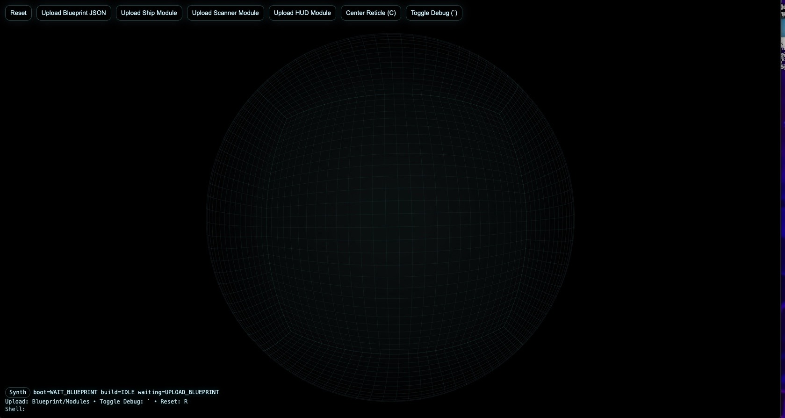
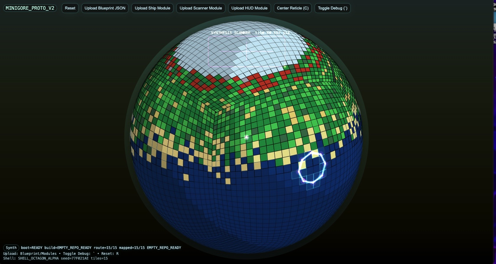

# Synth Grid Engine

A blueprint-driven simulation shell where geometry becomes computation.

This project is an experimental system that treats space like a filesystem and entities like autonomous executors. The world itself becomes a programmable environment.

Inspired by:
- TRON Grid Worlds
- Geometry Wars style spatial computation
- Modular OS-like simulation environments

---

# Core Idea

Instead of building a fixed application, the engine loads **blueprints** that define how the world behaves.

The system consists of three blueprint layers:

1. **Shell Blueprint**
   Defines the world geometry.

2. **Module Blueprints**
   Attach systems into the world.

3. **Execution Layer**
   Deterministic simulation loop.

Geometry = storage  
Movement = computation  
Entities = executors  

---

# Math-First Simulation

The engine is math-first, not graphics-first.

The simulation runs entirely in deterministic 2D vector space, while the rendering layer projects the world to appear visually 3D.

This approach provides several advantages:

• extremely low CPU usage

• deterministic reproducible worlds

• simple debugging and validation

• portable execution on almost any hardware


Even older machines (2010–2012 era laptops) can run the simulation smoothly.

# 2D Core → Visually 3D

All world logic runs in 2D simulation space.

Rendering then projects that simulation into a visually 3D environment using techniques such as:

- perspective scaling

- layered sprites

- cube grid projection

- depth shading

This creates a 3D-like environment without the cost of a full 3D engine.


---

# Example World




The included example blueprint: blueprint_octagon.json

Builds an octagon shell structure where modules can attach.

---

# Controls
```
{
| Key | Action |
|----|----|
| WASD | Move master control |
| Mouse | Aim vector |
| C | Toggle reticle |
| ` | Toggle debug overlay |
| R | Reset |
}
```
---

# Running the Engine

1. Download the repository
2. Open index.html


in a browser.

No server required.

---

# Loading Blueprints

Upload blueprints into the runtime UI.

Recommended order:

1️⃣ Shell blueprint  

2️⃣ Ship module  

3️⃣ Scanner module  

4️⃣ HUD module (optional)  

---

# Blueprint Format

Example module blueprint

```json
{
  "moduleType": "scanner",
  "id": "SCAN_01",
  "style": "default",
  "config": {},
  "script": ""
}
```

</details>

# Engine Prototype

<details>
<summary>Click to view Synth Grid Engine prototype</summary>



Example simulation of the Synth Grid Engine.

The world runs on a **deterministic 2D simulation core** while projecting visually as a 3D sphere.

Each tile represents simulation state generated from blueprint geometry.

This prototype demonstrates:

• blueprint shell generation  
• cube-grid projection mapping  
• deterministic seed worlds  
• modular system attachment  
• spatial execution visualization  

The interface allows runtime loading of:

- Shell Blueprints
- Ship Modules
- Scanner Modules
- HUD Modules

This prototype is also being used as a base for the **ThingsHappening game systems**.

</details>


2026-03-06 Update: Eye-Lock synth visual pass added. The master ship is now drawn as a reticle-locked synth eye/pupil at screen center, with a dark glass lens shell, magenta plasma field, expanded crosshair geometry, and scanner bloom tuned toward the supplied reference image.
2026-03-06 Update: Eye-Core pass added. The center now uses a true pupil-disc stack with slit beam, heading-reactive ship glyph, breathing plasma ellipses, stronger reticle arcs, and subtle shell/grid distortion so movement reads as the universe moving around a fixed synth eye.


[v5 Eye-Scan update]
- Added scanner sweep wedge and ping-ring runtime behavior.
- Added deterministic contact markers derived from shell seed and route shape.
- Added presentation mode toggle (P) for clean cinematic view.
- Eye core now reacts to scan ping cadence and module identity.
- Preserved center-lock / eye-pupil architecture while pushing runtime behavior toward a real synth instrument surface.


Truth-Surface v6 update:
- blueprint-derived semantic contacts (pivot, wall, door, room, anomaly)
- deterministic shell warp keyed to shell seed
- scanner contact persistence and class-aware rendering
- ship/scanner module configs now visibly alter iris/slit and sweep behavior
- expanded debug truth surface for class counts and center-lock state


Anchor-Center v7 update:
- blueprint pivots are re-centered around their canonical centroid before shell construction
- the blueprint mass now sits on the reticle-aligned anchor instead of drifting off-center
- seed compilation now includes anchor-centered normalized blueprint geometry
- HUD/debug now report anchor mode, anchor source, centroid shift, and canonical blueprint hash
- this is the first pass toward exact two-way retraceable reticle/location seeding


Pole-Compass v8 update:
- added bottom-right pole detector / compass overlay locked to world pole directions
- compass labels N/E/S/W now derive from the camera-rotated global axes instead of screen-only decoration
- pole detector reports nearest locked pole, angular offset, and alignment state
- truth/debug panels now include pole lock telemetry


## v10 Authority / Proof Upgrade
- Added canonical reticle proof summaries.
- Added receipt export and survey export.
- Added lifecycle contract verification for boot/build transitions.
- Added richer receipt envelopes for auditability.
