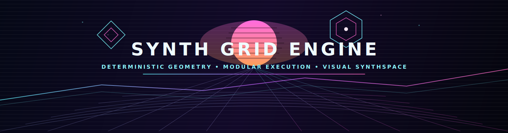
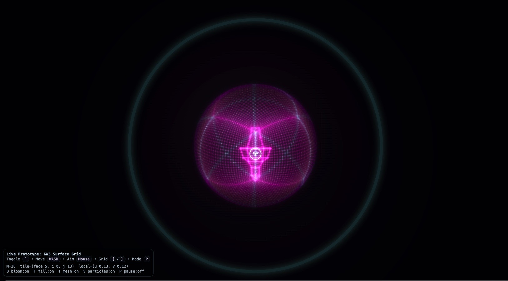
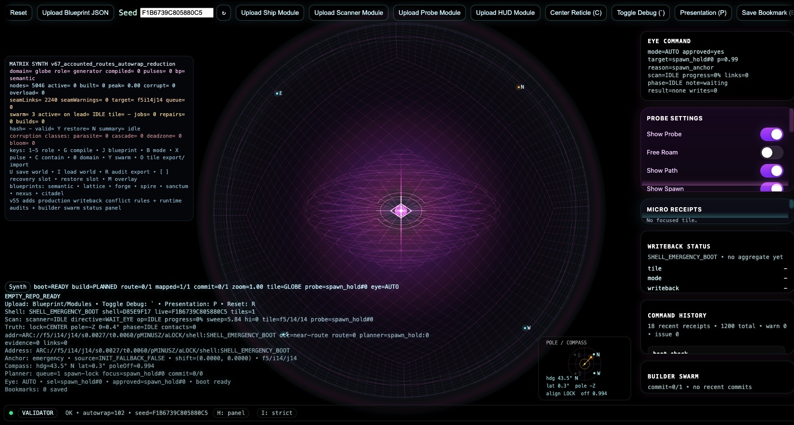
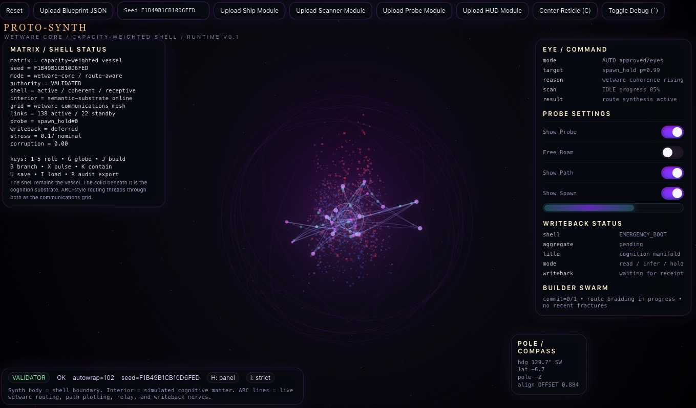
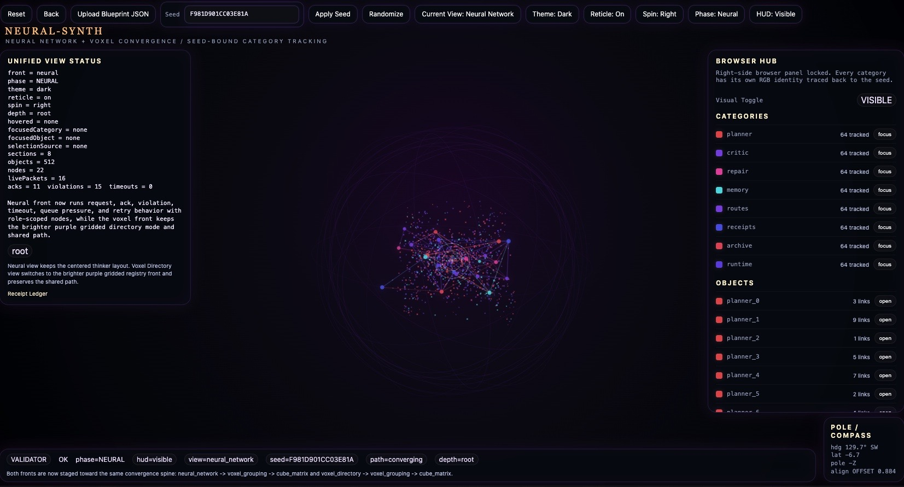
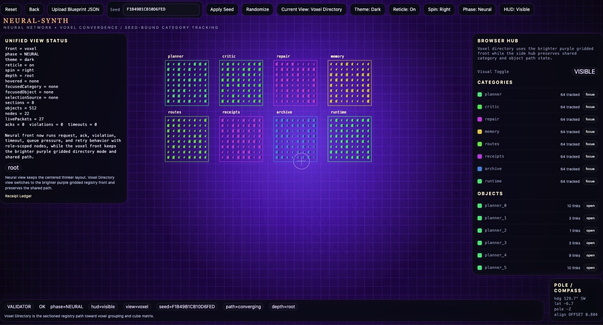

# I/O SYNTH GRID ENGINE

<p align="center">
  
</p>

<p align="center"><strong>Deterministic 2D simulation. Projected to feel visually 3D.</strong><br><strong>Blueprint geometry becomes computation.</strong></p>

<p align="center">
  <a href="https://github.com/GareBear99/Synth-Grid-Engine/issues"></a>
  <a href="https://github.com/GareBear99/Synth-Grid-Engine/discussions"></a>
  <a href="https://github.com/GareBear99/Synth-Grid-Engine/stargazers"></a>
  <a href="https://github.com/GareBear99/Synth-Grid-Engine/network/members"></a>
</p>

<p align="center">
  <a href="https://github.com/sponsors/GareBear99"></a>
  <a href="https://www.buymeacoffee.com/YOUR_HANDLE"></a>
</p>

## What this is

Synth Grid Engine is a math-first world runtime where shell geometry, module layout, and deterministic execution all share the same blueprint-driven foundation.

Instead of treating geometry as decoration, the engine treats it as structure, storage, routing, and execution space. The world itself becomes a programmable surface.

This project is built around a **deterministic 2D simulation core** with a **visually 3D projection layer**. That keeps the runtime lightweight, reproducible, and portable while still delivering a high-contrast synthwave spatial feel.

## Iteration 0 — Synth Shell #0

- Lucipher Synth #0
## Core idea

The engine loads blueprints that define how the world behaves.

### 1) Shell Blueprint
Defines the geometry of the world.

### 2) Module Blueprints
Attach systems into the shell.

### 3) Execution Layer
Runs the deterministic simulation loop.

**Geometry = storage**  
**Movement = computation**  
**Entities = executors**

## Why it is different

- **Math-first, not graphics-first**
- **Deterministic worlds from seed and blueprint state**
- **2D simulation core with visually 3D presentation**
- **Low CPU footprint on older hardware**
- **Modular runtime architecture instead of a fixed one-off application**
- **Designed as an engine surface for future systems, not just a demo**

## Iteration path

## Iteration 8 — Blueprint Shell Prototyping


- Shell Synth

Included example blueprint: `blueprint_octagon.json`

Builds an octagon shell structure where modules can attach.

## Iteration 9 — Game Engine Prototype

<details>
<summary>Click to expand Iteration 9 prototype</summary>


This prototype demonstrates:

- blueprint shell generation
- cube-grid projection mapping
- deterministic seed worlds
- modular system attachment
- spatial execution visualization

The runtime supports loading:

- Shell Blueprints
- Ship Modules
- Scanner Modules
- HUD Modules

</details>

## Iteration 10 — Synth Grid Engine


- Lucid Terminal Master Control Synth #1

A blueprint-driven simulation shell where geometry becomes computation.

This engine is experimental by design, but the direction is serious: modular world runtime, blueprint-authored structure, deterministic simulation, and portable execution.

## Iteration 11 — NEURAL-SYNTH / wetware core / runtime v0.1



## Math-first simulation

All core logic runs in deterministic 2D vector space.

The render layer then projects that simulation into a visually 3D environment using techniques like:

- perspective scaling
- layered sprite depth
- cube-grid projection
- depth shading
- shell geometry overlays

That gives the engine a 3D-feeling spatial surface without requiring a heavyweight full-3D stack.

## NEURAL-SYNTH / wetware core / runtime v0.2




## Voxel Directory



Fully RGB Customizeable back to reproducible seed and both 'Voxel Directory' and 'Neural-Synth' are in sync. 

## Controls

| Key | Action |
|---|---|
| `W A S D` | Move master control |
| `Mouse` | Aim vector |
| `C` | Toggle reticle |
| `` ` `` | Toggle debug overlay |
| `R` | Reset |

## Running the engine

1. Download or clone the repository.
2. Open `index.html` in a browser.
3. Load blueprints through the runtime UI.

No server required.

## Recommended load order

1. Shell blueprint  
2. Ship module  
3. Scanner module  
4. HUD module (optional)

## Example module blueprint

```json
{
  "moduleType": "scanner",
  "id": "SCAN_01",
  "style": "default",
  "config": {},
  "script": ""
}
```

## Contributing

Ideas, bug reports, architecture suggestions, and module experiments are welcome.

- Open an **Issue** for bugs or concrete work
- Use **Discussions** for ideas, design direction, or architecture talk
- Open a **Pull Request** for improvements

Read [CONTRIBUTING.md](CONTRIBUTING.md) before sending major changes.

## Support the project

If you want to help push this engine further:

- **GitHub Sponsors:** `https://github.com/sponsors/GareBear99`
- **Buy Me a Coffee:** replace the placeholder in this README and in `.github/FUNDING.yml`

Support helps with development time, testing, visuals, documentation, and future releases.

## Community links

- **Issues:** `https://github.com/GareBear99/Synth-Grid-Engine/issues`
- **Discussions:** `https://github.com/GareBear99/Synth-Grid-Engine/discussions`
- **Pull Requests:** `https://github.com/GareBear99/Synth-Grid-Engine/pulls`
- **Releases:** `https://github.com/GareBear99/Synth-Grid-Engine/releases`

## Repo setup checklist

- Enable **Issues**
- Enable **Discussions**
- Add repo **Topics**
- Add a **Description** and **Website** if relevant
- Upload a strong **Social Preview Image**
- Create the first **Release**
- Pin one **Discussion** for roadmap / ideas
- Add repo **Topics** like `html5`, `javascript`, `deterministic-simulation`, `synthwave`, `game-engine`, `procedural`, `2d`, `3d-illusion`

## License


